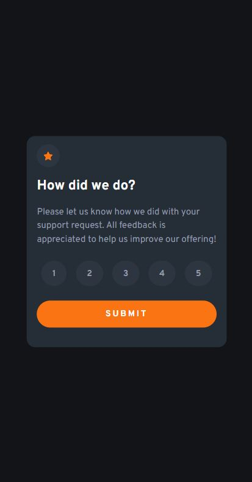

# Frontend Mentor - Interactive rating component solution

This is a solution to the [Interactive rating component challenge on Frontend Mentor](https://www.frontendmentor.io/challenges/interactive-rating-component-koxpeBUmI). Frontend Mentor challenges help you improve your coding skills by building realistic projects. 

## Table of contents

- [Overview](#overview)
  - [The challenge](#the-challenge)
  - [Screenshot](#screenshot)
  - [Links](#links)
- [My process](#my-process)
  - [Built with](#built-with)
  - [What I learned](#what-i-learned)
  - [Useful resources](#useful-resources)
- [Author](#author)

**Note: Delete this note and update the table of contents based on what sections you keep.**

## Overview

### The challenge

Users should be able to:

- View the optimal layout for the app depending on their device's screen size
- See hover states for all interactive elements on the page
- Select and submit a number rating
- See the "Thank you" card state after submitting a rating

### Screenshot




### Links

- Solution URL: [https://github.com/danyela2000/interactive-rating-component](https://github.com/danyela2000/interactive-rating-component)
- Live Site URL: [https://joyful-profiterole-f4f32e.netlify.app/](https://joyful-profiterole-f4f32e.netlify.app/)

## My process

### Built with

- Semantic HTML5 markup
- CSS custom properties
- Flexbox
- Mobile-first workflow
- JavaScript
- Event listeners
- Modify styles, add/remove css classes using JavaScript

### What I learned
I learned something new while I was working at this project.
I learned how to make a button/item in css to remain selected until I select another one.

First, I added a common class to all the rating items, in order to select them in JavaScript, for later use.

```html
<ul class="rating-section">
      <li class="rating-item" id="1">1</li>
      <li class="rating-item" id="2">2</li>
      <li class="rating-item" id="3">3</li>
      <li class="rating-item" id="4">4</li>
      <li class="rating-item" id="5">5</li>
    </ul>
``

Then, I created a class in css called "active" which represents the selected state of a rating item.

```css
li.active {
    color: var(--White);
    background-color: var(--Light-grey);
}
```

Then, in JavaScript, I selected all the rating items from the DOM and for each rating item I added an event listener.
If a rating item is selected then I remove the active class from all items.
Then I added the active class just for the current selected item.

```js
ratingItems.forEach(ratingItem => {
    ratingItem.addEventListener("click", () => {
        ratingItems.forEach(item => item.classList.remove('active'))
        ratingItem.classList.add("active")
    })
})
```

I also learned how to import a css file into another one.

```css
/*  target css file*/

@import "css-reset.css";
```

### Useful resources

- [https://www.geeksforgeeks.org/how-to-include-one-css-file-in-another/](https://www.geeksforgeeks.org/how-to-include-one-css-file-in-another/) - This helped me understand how to include a css file in another one.

## Author
- Frontend Mentor - [https://www.frontendmentor.io/profile/danyela2000](https://www.frontendmentor.io/profile/danyela2000)


